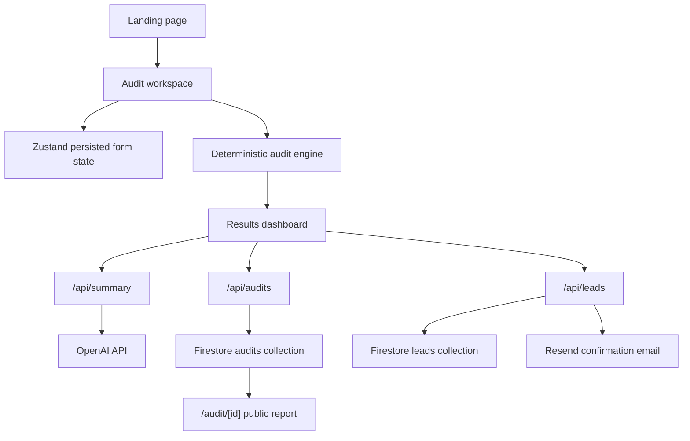

# SpendPilot AI Architecture

## Overview

SpendPilot AI is a Next.js 15 App Router SaaS MVP for auditing AI subscription and API spend. The product uses deterministic TypeScript logic for calculations, then optionally asks OpenAI to summarize the already-computed findings. Secrets stay server-side and are read from environment variables.

## Key Decisions

- App Router keeps page, API, and metadata concerns colocated.
- Zustand with localStorage preserves in-progress audits without account creation.
- Audit math lives in `src/lib/audit`, not components, so UI and APIs share one source of truth.
- Firestore writes go through server routes to keep validation, rate limits, and abuse checks centralized.
- OpenAI is used only for narrative generation. Savings are deterministic and testable.
- The public report excludes lead-capture details and stores only audit inputs, totals, recommendations, and summary.

## Data Flow

1. User enters tools in `/audit/new`.
2. Client validates inputs and runs the deterministic engine for immediate results.
3. Client can request `/api/summary`; the server reruns the audit from line items and sends sanitized findings to OpenAI.
4. Client can save the report through `/api/audits`; Firestore returns a public report ID.
5. Lead capture posts to `/api/leads`, stores the lead, and attempts a Resend confirmation email.

## Tradeoffs

- Firebase Admin SDK is preferred for production. This MVP can use the existing Firebase web configuration through server routes, but production Firestore rules should be tightened before launch.
- The rate limiter is in-memory. It is useful for local and single-instance deployment, but Redis or Upstash would be better for multi-region production.
- Charts are CSS-based to avoid dependency weight. A later analytics-heavy product could add a charting library.
